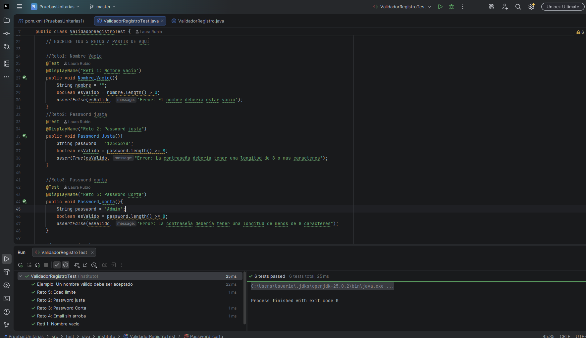
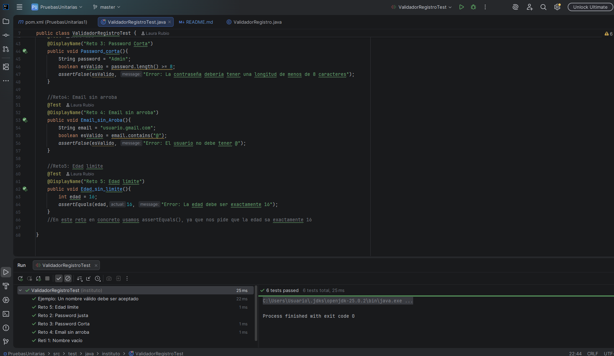

# 🌸 Validador de Registro - Prácticas de Testing con JUnit 🧪


## 📌 Descripción del Proyecto

Este repositorio contiene la implementación de una serie de **Pruebas Unitarias** diseñadas para verificar la lógica de un sistema de registro de usuarios (`ValidadorRegistro.java`). 

El objetico principal de este proyecto es aplicar los conceptos aprendidos sobre testing de software utilizando **JUnit 5**, verificando que el sistem acepte los test válidos y que se elijan y se usen de forma correcta los distintos tipos de *assert* previamente vistos.
Además, otro de los objetivos es aprender a clonar y usar nuestro propio repositorio sobre el clonado. A la vez que aprendemos a hacer README como este.

## ⚙️ Tecnologías Utilizadas

* **Lenguaje:** Java
* **Framework de Testing:** JUnit 5 (Jupiter)
* **Gestor de Dependencias:** Maven
* **IDE Recomendado:** IntelliJ IDEA

## 🧪 Casos de Prueba Implementados (Retos)

Se han desarrollado pruebas específicas para cubrir diferentes escenarios de validación de datos:

1. **Nombre Válido (Ejemplo base):** Verifica que el sistema acepta un nombre de usuario estándar.
2. **Nombre Vacío:** Le enviamos al programa un nombre en blanco "". Como nadie debería poder registrarse sin nombre, comprobamos que el sistema lo rechaza (assertFalse).
3. **Contraseña Justa (Límite):** Probamos con una contraseña de exactamente 8 caracteres, en este caso "123456". Como 8 es el mínimo permitido, comprobamos que el programa lo acepta (assertTrue).
4. **Contraseña Corta:** Escribimos una contraseña de solo 5 letras en este caso "Admi". Como no es segura, verificamos que el sistema no la deja pasar (asserFalse).
5. **Email sin Arroba:** Invertimos un correo que no tiene el símbolo de la arroba, en este caso "usuario.gmail.com". Al estar mal escrito, el programa tiene que bloquearlo (assertFalse).
6. **Edad Límite Legal:** Comprobamos qué pasa si alguien tiene justo la edad mínima legal, en este caso 16 años. El programa debe permitirle registrarse sin problema(assertEquals).

## 🚀 Instalación y Ejecución Local

Una vez hecho los retos le damos a ejecutar y comprobamos en la consula que todo se ha ejecitado correctamente como vemos en la foto



## 📂 Estructura del Proyecto

A continuación se detalla la organización de los archivos y directorios de este repositorio:

* 📁 **`.idea/`**: Contiene los archivos de configuración y preferencias específicas del entorno de desarrollo (IntelliJ IDEA).
* 📁 **`src/`**: Es el directorio principal del código fuente. Tradicionalmente en proyectos Maven se divide en:
  * `main/java/`: Donde se encuentra la lógica de la aplicación (la clase `ValidadorRegistro.java`).
  * `test/java/`: Donde se encuentran las clases con las pruebas unitarias de JUnit.
* 📄 **`pom.xml`**: Archivo de configuración de Maven. Aquí se definen las dependencias del proyecto, como JUnit 5.
* 📄 **`.gitignore`**: Le indica a Git qué archivos y carpetas no deben subirse al repositorio (como archivos temporales o compilados).
* 📄 **`README.md`**: Es este mismo archivo, que sirve como documentación principal del proyecto.
* 🖼️ **`primerafoto.png`** y **`segundafoto.png`**: Capturas de pantalla que demuestran la correcta ejecución de los tests en la consola.


### 1. Clonar el repositorio
Abre tu terminal o tu IDE y ejecuta el siguiente comando:
```bash
git clone [https://github.com/](https://github.com/)[TU-USUARIO-DE-GITHUB]/PruebasUnitarias1.git
